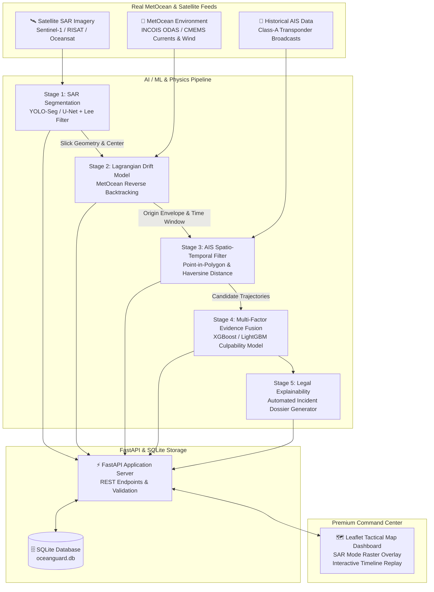

# 🌊 OceanGuard AI — Comprehensive System Architecture & SIH26143 Blueprint

**Problem Statement**: SIH26143 • Marine Oil Spill Detection, MetOcean Backtracking & AIS Vessel Attribution System (MOSTA)  
**Nodal Ministry / Organization**: Ministry of Earth Sciences (MoES) / Indian National Centre for Ocean Information Services (INCOIS) / Indian Coast Guard (ICG)  
**Team**: SamadhanLabs  

---

## 🎯 1. SIH26143 Problem Statement In-Depth Exploration

### 1.1 The Critical National & Environmental Challenge
India boasts a coastline exceeding **7,516 km** and an Exclusive Economic Zone (EEZ) encompassing **2.37 million km²**. Every year:
- Over **100,000 commercial cargo ships, crude oil tankers, and bulk carriers** transit high-density maritime choke points (e.g., Arabian Sea Mumbai High corridor, Gulf of Kutch oil terminals, Palk Strait, and the Great Channel near Andaman & Nicobar).
- Unscrupulous vessels exploit the cover of darkness and open-ocean isolation to conduct **illegal oily bilge dumping, sludge de-ballasting, and tank-washing** to evade port disposal tariffs.
- By the time satellite imagery (Sentinel-1 / RISAT / Oceansat) detects an oil slick, **6 to 48 hours have elapsed**. Under the action of surface winds and ocean currents, the slick drifts tens of nautical miles away from the initial discharge location, and the culprit ship is long gone.

### 1.2 The Core Technical Requirements of SIH26143
1. **Automated SAR Satellite Detection**: Rapidly segment dark formation signatures from Synthetic Aperture Radar (SAR) imagery, mitigating look-alike false positives (biogenic slicks, low-wind sea areas, internal waves) using deep learning (YOLOv8-Seg / U-Net) and adaptive speckle filtering.
2. **Lagrangian Reverse Hydrodynamic Backtracking**: Execute reverse numerical particle integration incorporating **3.2% windage drift**, **Coriolis deflection**, **multi-depth surface currents** (INCOIS ODAS / CMEMS / HYCOM), and **Brownian turbulent diffusion** to derive the exact spatio-temporal origin polygon and release timestamp window.
3. **AIS Spatio-Temporal Filtering & Correlation**: Cross-reference historical Class-A AIS maritime broadcasts against the backtracked origin envelope, identifying candidate ships, computing closest approach distances, and detecting **speed-drop maneuvering anomalies** (abrupt deceleration to $\le 6\text{ kts}$ indicative of discharge).
4. **5-Factor Weighted Evidence Fusion & ML Attribution**: Calculate transparent, tamper-proof culpability rankings (0–100) using multi-factor evidence scoring combined with XGBoost / LightGBM classification.
5. **Enforceable Legal Dossier Generation**: Auto-compile legally admissible forensic timelines, trajectory overlays, and environmental logs admissible under the **Merchant Shipping Act (1958)** and **MARPOL 73/78 Annex I**.

---

## 🏗️ 2. High-Level Architecture (Excalidraw Blueprint Alignment)

---

## 🗄️ 3. Database Schema & SQLite ORM Models

The database models are fully implemented in `backend/app/db/models.py` with SQLite compatibility:

### 1. `investigations` Table
- `id` (VARCHAR PRIMARY KEY): e.g., `INV-2026-001`
- `title` (VARCHAR): Case title (e.g., `Mumbai High Offshore Slick`)
- `region` (VARCHAR): Maritime operational basin
- `status` (VARCHAR): `IN_PROGRESS`, `INVESTIGATION COMPLETE`
- `summary` (TEXT): High-level operational summary
- `created_at` (DATETIME): UTC timestamp

### 2. `spills` Table
- `id` (VARCHAR PRIMARY KEY): e.g., `SPILL-001`
- `investigation_id` (VARCHAR FOREIGN KEY -> investigations.id)
- `observation_time` (DATETIME): Sentinel-1 acquisition time
- `centroid_lat`, `centroid_lon` (FLOAT): Geographic center
- `area_km2` (FLOAT): Physical slick surface footprint
- `confidence` (FLOAT): AI detection confidence score (0.00 - 1.00)
- `slick_type` (VARCHAR): Emulsion classification
- `geometry_json` (JSON): Vector coordinates of polygon boundary

### 3. `drift_results` Table
- `id` (VARCHAR PRIMARY KEY): Backtracking task ID
- `spill_id` (VARCHAR FOREIGN KEY -> spills.id)
- `origin_lat`, `origin_lon` (FLOAT): Computed origin centroid
- `likely_start_time`, `likely_end_time` (DATETIME): Calculated discharge window
- `uncertainty_envelope` (VARCHAR): e.g., `± 1.8 km dispersion`
- `origin_polygon_json` (JSON): Convex Hull bounding envelope
- `drift_vector_json` (JSON): Reverse trajectory checkpoints

### 4. `vessels` Table
- `mmsi` (VARCHAR PRIMARY KEY): Maritime Mobile Service Identity
- `imo` (VARCHAR): International Maritime Organization registry ID
- `name` (VARCHAR): Ship call name
- `flag` (VARCHAR): Flag state registry (e.g., `Panama (PA)`)
- `vessel_type` (VARCHAR): `Crude Oil Tanker`, `Bulk Cargo Carrier`, etc.
- `length_m`, `deadweight_tonnage` (FLOAT): Vessel physical dimensions

### 5. `ais_positions` Table
- `id` (INTEGER PRIMARY KEY AUTOINCREMENT)
- `mmsi` (VARCHAR FOREIGN KEY -> vessels.mmsi)
- `timestamp` (DATETIME): Broadcast time
- `latitude`, `longitude` (FLOAT): Position coordinates
- `speed_knots` (FLOAT): SOG (Speed Over Ground)
- `heading_deg` (FLOAT): COG (Course Over Ground)

### 6. `evidence_scores` Table
- `id` (INTEGER PRIMARY KEY AUTOINCREMENT)
- `investigation_id` (VARCHAR FOREIGN KEY -> investigations.id)
- `mmsi` (VARCHAR FOREIGN KEY -> vessels.mmsi)
- `rank_order` (INTEGER): Final attribution rank (1, 2, 3...)
- `overall_score` (FLOAT): Fused evidence score (0 - 100)
- `proximity_score`, `time_match_score`, `trajectory_score`, `drift_score`, `ais_quality_score` (FLOAT)
- `justification` (TEXT): Legal explainability paragraph

---

## ⚡ 4. Backend REST Routing & Endpoints Specification

| Method | Path | Summary | Input Payload | Output Response |
| :--- | :--- | :--- | :--- | :--- |
| **GET** | `/health` | System health & component diagnostics | None | Operational status of all 4 modules |
| **POST** | `/detect` | SAR Raster AI segmentation & vectorization | Image path / sensor metadata | Slick centroid, area ($km^2$), polygon coordinates |
| **POST** | `/trace` | Lagrangian reverse drift backtracking | Observed location, time, MetOcean data | Origin centroid, envelope polygon, release time window |
| **POST** | `/match-vessels` | Spatio-temporal AIS trajectory filtering | Origin polygon, start time, end time | Candidate ships with $d_{\min}$, speed drop, trajectory |
| **POST** | `/rank` | Multi-Factor Evidence Fusion & ML Ranking | Investigation ID, Candidate list | Ranked suspect list with factor scores & justifications |
| **GET** | `/investigations` | Retrieve all active & archived investigations | Query filters | List of full investigation cases |

---

## 🌊 5. Mathematical & Physics Backtracking Formulation

### Forward Lagrangian Hydrodynamic Drift:
$$\vec{v}_{\text{drift}} = \vec{u}_{\text{current}} + \alpha \cdot \mathbf{R}(\theta_{\text{Coriolis}}) \cdot \vec{u}_{\text{wind}} + \vec{u}'_{\text{turbulent}}$$
Where:
- $\alpha = 0.032 \pm 0.004$ (3.2% oil windage factor)
- $\theta_{\text{Coriolis}} = +10^\circ$ (Ekman / Coriolis deflection in Northern Indian Ocean)
- $\vec{u}'_{\text{turbulent}} = \sqrt{\frac{2 K_h}{\Delta t}} \cdot \mathcal{N}(0, 1)$ with horizontal eddy diffusivity $K_h = 2.5\text{ m}^2/\text{s}$

### Reverse Backtracking Integration:
$$\vec{x}(t - \Delta t) = \vec{x}(t) - \vec{v}_{\text{drift}}(t) \cdot \Delta t$$
$$\Delta \text{lat} = \frac{-\bar{v}_{\text{drift}} \Delta t}{R_{\text{earth}}}, \quad \Delta \text{lon} = \frac{-\bar{u}_{\text{drift}} \Delta t}{R_{\text{earth}} \cos(\text{lat})}$$

---

## 🏆 6. Evidence Scoring & ML Formula (Section 9)

$$\text{Evidence Score} = 0.30 \cdot S_{\text{prox}} + 0.25 \cdot S_{\text{time}} + 0.20 \cdot S_{\text{traj}} + 0.15 \cdot S_{\text{drift}} + 0.10 \cdot S_{\text{ais}}$$

1. **Proximity Score ($S_{\text{prox}}$)**:
   $$S_{\text{prox}} = 100 \cdot \exp\left(-\frac{d_{\min}}{8.0\text{ km}}\right)$$
2. **Time Window Match ($S_{\text{time}}$)**: Evaluates overlap minutes inside calculated release window.
3. **Trajectory & Behavioral Anomaly ($S_{\text{traj}}$)**: Penalizes sudden open-sea deceleration ($\Delta v \ge 4.0\text{ kts}$ indicates illegal discharge activity) + vessel cargo risk weighting.
4. **Drift Axis Consistency ($S_{\text{drift}}$)**: Geometric alignment between vessel transit heading and reverse drift plume axis.
5. **AIS Quality & Completeness ($S_{\text{ais}}$)**: Broadcast continuity without deliberate transponder gap intervals.
